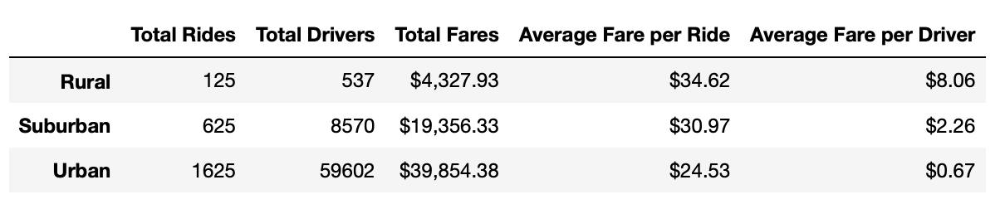
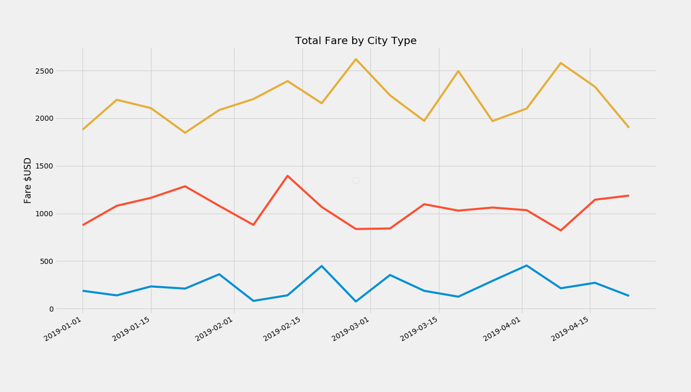

# Pyber Analysis
An analysis performed for Pyber to create an overall snapshot of the ride-sharing data, with a summary table of key metrics of the ride-sharing data by city type, and a multiple-line graph that shows the average fare for each week by each city type.

## Findings
* The summary table shows us that urban areas have the largest number of drivers and riders, though the average fare per rider is actually higher in the rural and suburban areas. This could be attributable to the fact that urban rides are likely over shorter distances, while suburban and rural rides may be longer.

* The corresponding multiple line graph shows us that total fares in urban locations are higher than total rural or suburban fares. As we know, this does not indicate that individual ride fares in urban cities are higher: average fares per rider vary between urban, rural, and suburban rides depending on distances. Urban locations likely have more frequent use of Pyber's services, hence the higher total fare amount.

